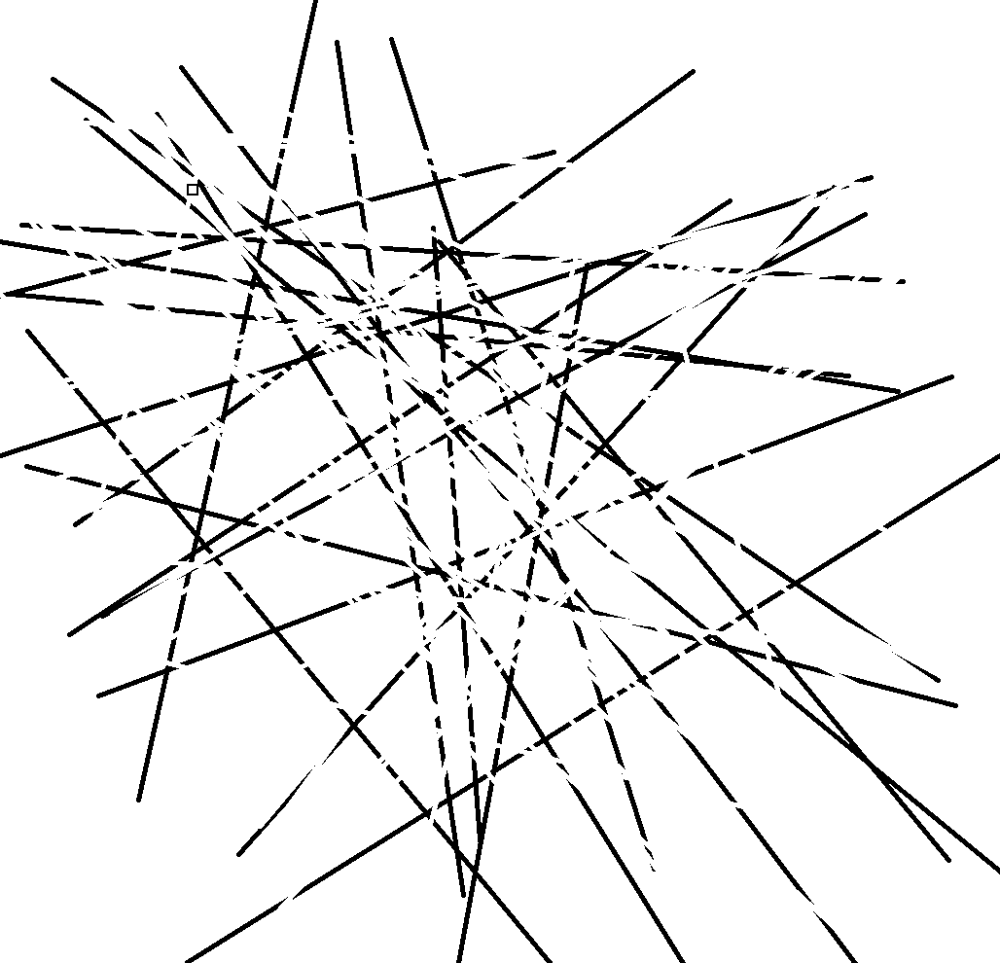
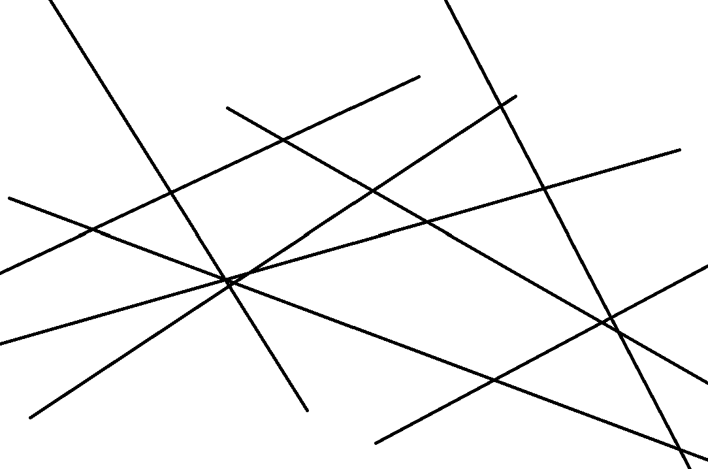
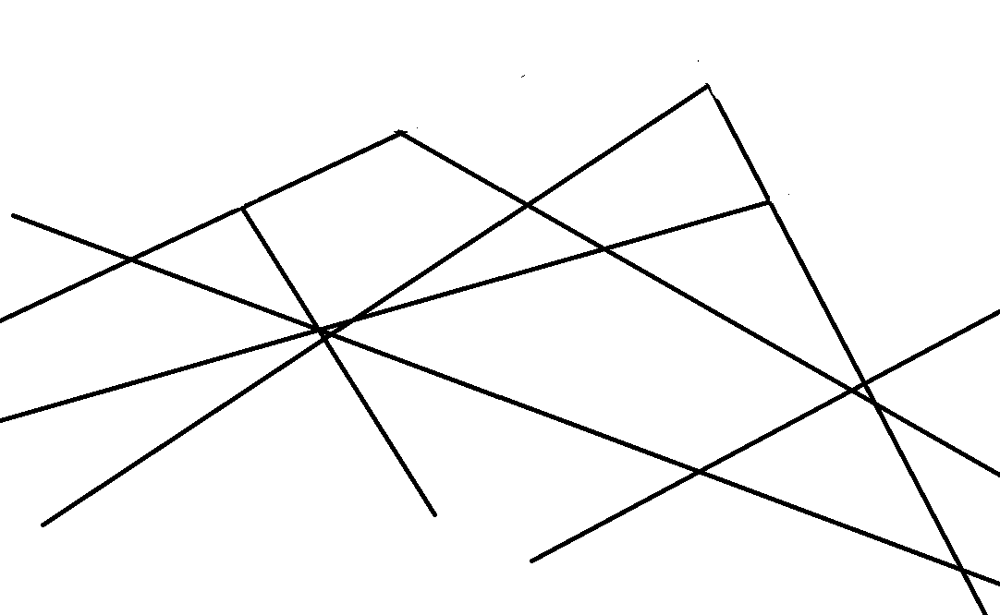

# Day 01
## Computing without computer

### Sprout
Dots are placed randomly. Two players take turns to connect two dots each time.
If a dot has three connections it cannot be used anymore.
If a player cannot draw a new connection without crossing another one the other player wins.

It was a fun exercise to see how simple rules can be used to generate many different outcomes. I also particularly
enjoyed the process of doing it in collaboration, as part of a game. I learned that paper sketches can be useful
to prototype many different ideas quickly, to gain an understanding on how rules are applied, and how that could
translate into code.

## Playing around with p5
### Mountain Skiers
The original idea was not to create something resembling mountains.
To explore p5 for the first time I simply drew lines across the window at random angles.
I then drew over that to erase those lines at random positions again.
(I don't have the exact code of the previous versions anymore, but I sketched what it roughly looked like.)




Later I took a step back, and without erasing the lines I was left with lines that reminded me of mountains, if I only
drew them in angles in a narrower range, and if you would erase the lines outside of the mountain's ridge.
So not only did I generate art, but I realized that my concept of what I wanted to make generated itself, step by step.




I expanded on that and now I am left with choosing random positions on the screen, drawing two lines downwards at an angle to create
the mountain ridge.

Next, I calculate the outside bounds of the mountain ridge to create a shape where I draw some more random dots
that move, resembling falling snow.

Mountains then made me think of skiers, so I use some more randomly placed dots that move downwards and to the side randomly, which are
occluded by the shape outside of the mountain ridge and placed at the top of the screen again once they reach the bottom.
These randomly placed dots then leave a trail to resemble skiers going down the mountains.


<iframe src="content/day01/01/embed.html" width="100%" height="450" frameborder="no"></iframe>

