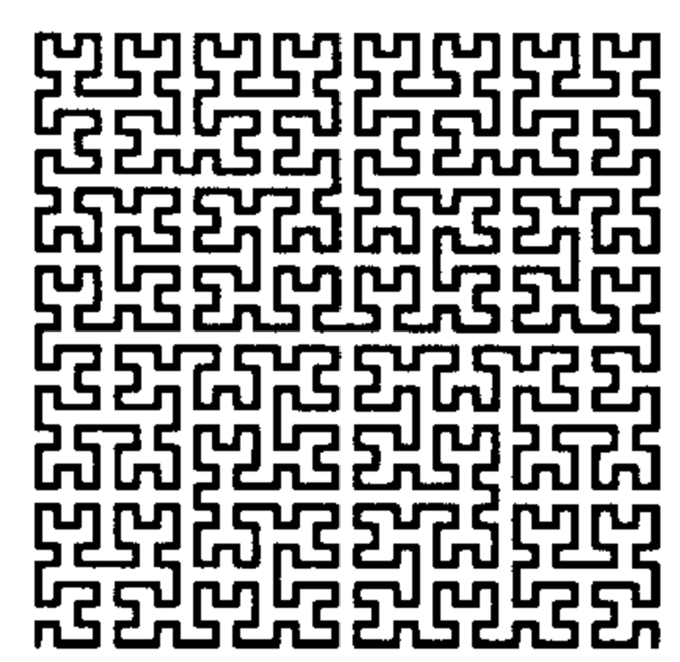
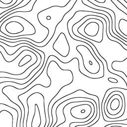
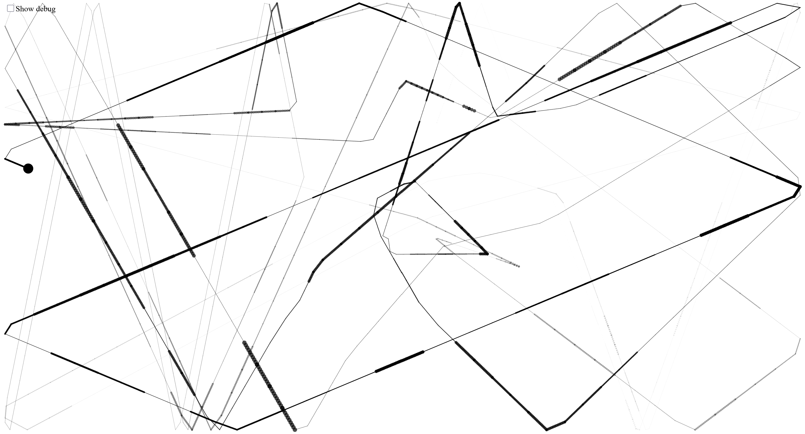
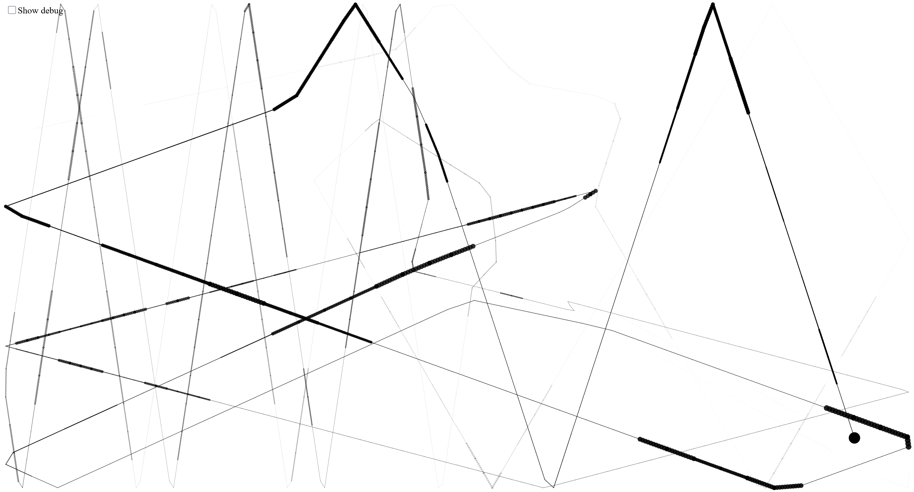
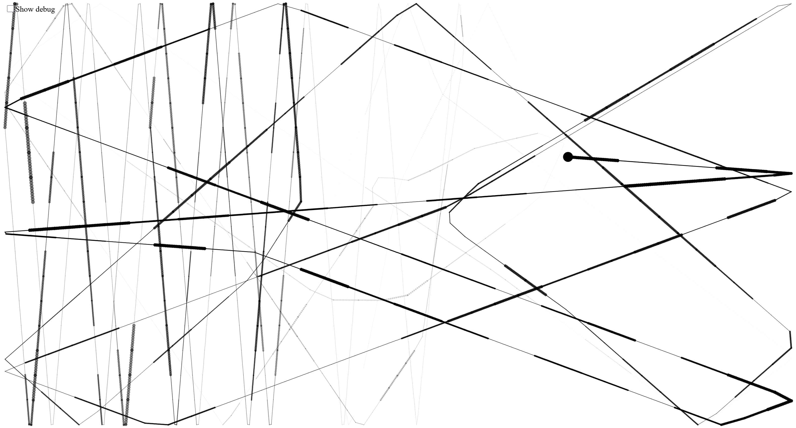
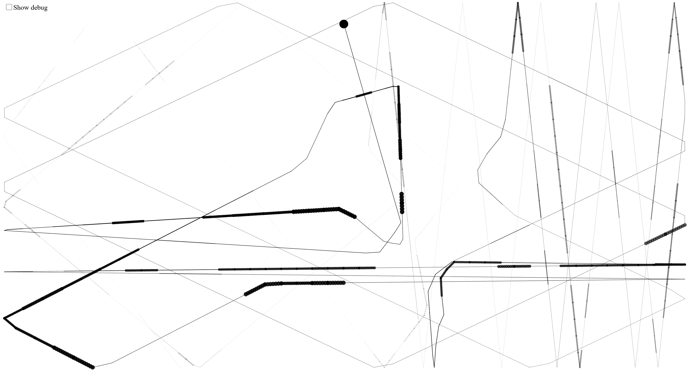

# Day 04
## Drawing Machines
### Bubble Machine
Based on the [Lissajous example](https://editor.p5js.org/guma/sketches/gJAZwbKlG) I started drawing circles as a base.
I made the circles draw continuously at the mouse position and came up with the following rule:
The velocity of the mouse determines the radius of the circle.

As I was drawing with this machine it reminded me of air bubbles in water.
Inspired by this I animated the bubbles surfacing to the top of the screen.

Just like a bubble bursting, they play a sound when reaching the top.
The pitch is determined by the radius of the bubble.

By quantizing the pitch of the sound to a pentatonic scale no "wrong" (or rather dissonant) notes can be played.
I chose the sound of a kalimba for this, because - naturally - many kalimbas are tuned to a pentatonic scale, and they
work well to just jam on and end up with a more or less always pleasant sound.

Finally, by pressing the mouse button, drawing circles can be interrupted to have some more control over rhythm.

The machine behaves like an instrument, which is innately expressive, not a tool. The focus is on exploration, having an instrument
that anyone can play around with, not minding accuracy or efficiency.


<iframe src="content/day04/01/embed.html" width="100%" height="450" frameborder="no"></iframe>


### Ink On A Drum
#### Inspiration
Inspired by [this artwork](https://olafureliasson.net/artwork/connecting-cross-country-with-a-line-2013/) by Olafur Eliasson.
I thought about how I could translate the vibrations of a drum influencing a ball soaked in ink into digital form.

At first, I thought about actually simulating physics, but that wasn't only very complex to implement, but also not exactly
the point of recreating this in digital form. So I figured that I could come up with more simple rules, while still 
emulating the vibration of the drum.

#### Version 1
In my head, I then visualized the vibrations going outward as circles, oscillating between a larger and smaller scale.
These "vibration circles" would then push the ball away, perpendicular to the circle. 
To make this more chaotic I added more "vibration circles" and only made them push the ball away with a 50% chance,
otherwise letting the ball pass through. When colliding with the edges of the window the ball also bounces back, so it is always
shot back at the "vibration circles".


<iframe src="content/day04/02/embed.html" width="100%" height="450" frameborder="no"></iframe>


#### Version 2
With the current rules I was not satisfied with the sketch yet, as the outputs weren't really distinct and - to me - visually
interesting. I then thought about the original inspiration again, and what really made it fascinating was that the
drum used to influence the ink ball was on a train. This meant that the final output essentially portrayed the journey of the train
in an abstract form, like an imprint of the physical forces.

When thinking about how I would translate something like a journey into data I had the idea to sample the pixels of an image, 
stepping through them over time. So my drawing machine would then imprint the journey depicted in the image.

I asked ChatGPT for inputs on this and went with the simple solution of traversing the image using a hilbert curve, sampling
the pixel's luminance, gradient magnitude, and gradient angle.
LLM reference: https://chatgpt.com/share/69549d08-725c-800f-ad7a-a5e9f8398198

Example of a [hilbert curve](https://www.researchgate.net/figure/Hilbert-curve-filling-an-area-of-32-32-points_fig1_220492767):




For the image to traverse I used a simple [topographic map](https://freesvg.org/contour-map)




Finally, I decided to use the sampled pixel's luminance to decide the ink trail's thickness, while the gradient magnitude and angle affect
the "vibration" circles maximum radius and speed.


<iframe src="content/day04/03/embed.html" width="100%" height="450" frameborder="no"></iframe>


#### Outputs



