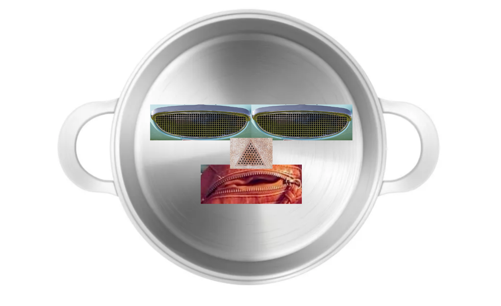
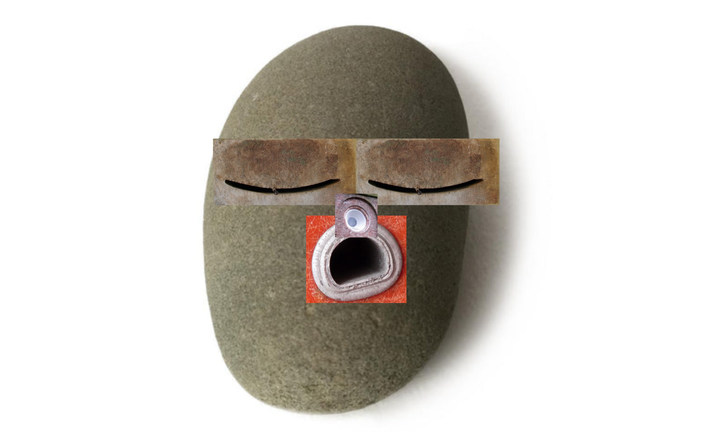
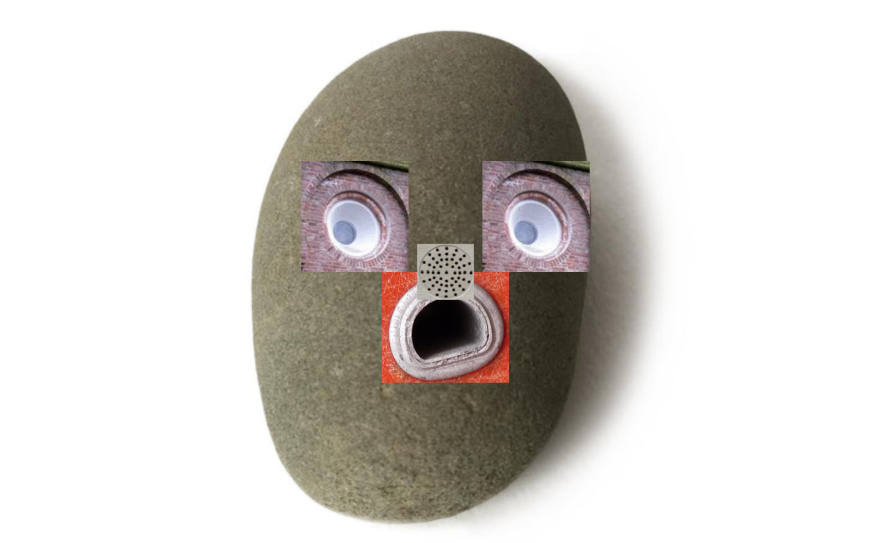
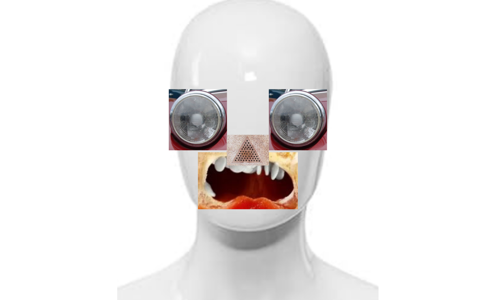

# Day 06
## Faces
### Pareidolia Collage
"Pareidolia is the tendency for perception to impose a meaningful interpretation on a nebulous stimulus, 
usually visual, so that one sees an object, pattern, or meaning where there is none." (https://digitalideation.github.io/gencg_h2501/lessons/lesson06_faces/)

When looking up images with examples of pareidolia I recognized that what we recognize as faces in there mostly consists only of 
the eyes and the mouth - either being holes or a protrusion - most of them round in shape. I found that the personality 
is most affected by the shape of the mouth, and/or the eyes, and sometimes the surface material as well. (e.g. gritty, cracked rock vs. fluffy moss)

My goal was to figure out whether it only works in certain constellations, or if it is really as simple as mashing different
holes or protrusions together for eyes, mouth and nose. I then collected 20 different snippets of 
just a single eye or mouth in images with pareidolia occuring to create a generator randomly combining them.

Sometimes I found that not all images work that well, especially for the nose. But what I found interesting is that even if 
certain images didn't work at all for the nose is that it was still very much recognizable as a face, just based on the positions.

To my surprise, I was immediately able to generate a variety of characters with very different personalities, sometimes
even more complex than I anticipated.

I found that adding different backgrounds resembling the shape of the head also had a significant impact on recognition and
personality.


<iframe src="content/day06/01/embed.html" width="100%" height="450" frameborder="no"></iframe>


### Pareidolia Face Recognition
Using face recognition the generated pareidolia face can be projected onto a real face, giving much more options for personality and expression.
This adds some continous parameters, to the so far discrete choice of eyes, nose and mouth.
The mouth can seem more open or closed, moving the eyes adds expression, and it is even possible to read the mimic of the pareidolia face to an extent.


<iframe src="content/day06/02/embed.html" width="100%" height="450" frameborder="no"></iframe>


### Outputs


<strong>Output 1: non-chalant, but seems like they'd enjoy a good party.</strong>

<strong>Output 2: sleepy-head. probably snoring.</strong>

<strong>Output 3: surprised, a bit scared.</strong>

<strong>Output 4: ready for a fight. The dummy head makes this combination more robotic / uncanny</strong>

<strong>Face Recognition Video</strong>

<video width="640" controls>
  <source src="content/day06/journal/02_recording.mp4" type="video/mp4">
  Your browser does not support the video tag.
</video>

